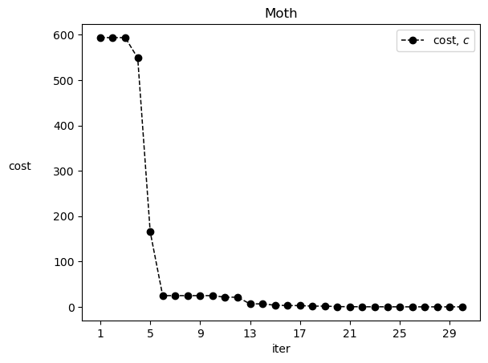

```julia
struct solution <:Any
    best::Float64
    bestIndividual::Vector{Float64}
    convergence::Vector{Float64}
    optimizer::String
    objfname::String
    executionTime
    ub::Float64
    lb::Float64
    dim::Int
    popnum::Int
end
```


```julia
function sort_moth(previous_population, best_flames, previous_fitness, best_flame_fitness, Optimization)
    N::Int = length(best_flames[1,:])
    dim::Int = length(best_flames[:,1])
    
    
    double_population = zeros(dim,2*N)
    double_population[:,1:N]=previous_population
    double_population[:,N+1:2*N]=best_flames
    
    double_fitness=zeros(2*N)
    double_fitness[1:N]= previous_fitness
    double_fitness[N+1:end]= best_flame_fitness
    
  
    
    if Optimization=="Maximization"
        double_fitness_sorted = sort(double_fitness, rev=true) #[end:-1:1]
    else
        double_fitness_sorted = sort(double_fitness)
    end
    
    #argsort
    if Optimization=="Maximization"
        i2 = sortperm(double_fitness, rev=true)
    else
        i2 = sortperm(double_fitness)
    end  
    
    
    double_sorted_population = zeros(dim,2*N)
    #
    for newindex in 1:(2*N)
        double_sorted_population[:,newindex] = double_population[:,i2[newindex]]
    end
    #
    # 
    #
    sorted_population = double_sorted_population[:,1:N]
    fitness_sorted = double_fitness_sorted[1:N]

    return sorted_population, fitness_sorted
end
```


    sort_moth (generic function with 1 method)


```julia
function MFO(dim::Int, objf::Function ; lb=-100, ub=100,  N=5, Max_iteration=10, Optimization="Minimization")


    # Initialize the positions of moths
    Moth_pos::Matrix{Float64} = rand(Float64, (dim, N)) * (ub - lb) .+ lb
    Moth_fitness::Vector{Float64} = zeros(N)

    
    Convergence_curve::Vector{Float64}  = zeros(Max_iteration)

    ##
    sorted_population::Matrix{Float64} = deepcopy(Moth_pos)
    fitness_sorted::Vector{Float64}  = zeros(N)
    #
    best_flames::Matrix{Float64} = deepcopy(Moth_pos)
    best_flame_fitness::Vector{Float64}  = zeros(N)
    #
    previous_population::Matrix{Float64} = zeros(dim, N)
    previous_fitness::Vector{Float64}  = zeros(N)
    #
#     s = solution()

    println("MFO is optimizing "  * string(nameof(objf)) )

    
    
    
    
    timerStart = time()
    #s.startTime = time.strftime("%Y-%m-%d-%H-%M-%S")

    Iteration::Int = 1

    ##### Main loop
    while (Iteration < Max_iteration)
    
  
        # Number of flames Eq. (3.14) in the paper
        Flame_no::Int = round(N - Iteration * ((N - 1) / Max_iteration))

        # Check if moths go out of the search spaceand bring it back
        Moth_pos = clamp.(Moth_pos, lb, ub)
            
        for i in 1:N 
            # evaluate moths
            Moth_fitness[i] = objf(Moth_pos[:,i])
        end
        
            
        ##############3 F_(t) := sort(M_t, F_t-1)###########################   
        if Iteration == 1
            # Sort the first population of moths
            if Optimization=="Maximization"
                fitness_sorted = sort(Moth_fitness, rev=true)
            else
                fitness_sorted = sort(Moth_fitness)
            end
            
                #argsort
            if Optimization=="Maximization"
                i = sortperm(Moth_fitness, rev=true)
            else
                i = sortperm(Moth_fitness)
            end

            sorted_population = Moth_pos[:,i]
            
            

        else# Iteration != 1
            
            sorted_population, fitness_sorted = sort_moth( previous_population, best_flames, 
                                                     previous_fitness, best_flame_fitness, Optimization)
        end  
            
        ##Update the flames
        best_flames = deepcopy(sorted_population)
        best_flame_fitness = deepcopy(fitness_sorted)
        
        ###########################################################################################    
            
            
        #
        ## Update the position best flame obtained so far
        global Best_flame_score = best_flame_fitness[1]
        global Best_flame_pos = best_flames[:,1]
        #
        previous_population = deepcopy(Moth_pos)
        previous_fitness = deepcopy(Moth_fitness)
        #
        # a linearly dicreases from -1 to -2 to calculate t in Eq. (3.12)
        a = -1 + Iteration * ((-1) / Max_iteration)

        # Loop counter
        for i in 1:N
            for j in 1:dim
                if (i <= Flame_no)  # Update the position of the moth with respect to its corresponsing flame
                    
                    # D in Eq. (3.13)
                    distance_to_flame = abs(best_flames[j, i] - Moth_pos[j, i])
                    b = 1
                    t = (a - 1) * rand(Float64) + 1
                    #
                    #% Eq. (3.12)
                    Moth_pos[j, i] = ( distance_to_flame * exp(b * t) * cos(t * 2 * 3.141592)
                                    + best_flames[j, i] ) 
                #
                elseif (i > Flame_no)  # Upaate the position of the moth with respct to one flame
                    
                    # % Eq. (3.13)
                    distance_to_flame = abs(best_flames[j,Flame_no] - Moth_pos[j, i])
                    b = 1
                    t = (a - 1) *  rand(Float64) + 1
                    #
                    # % Eq. (3.12)
                    Moth_pos[j, i] = (  distance_to_flame * exp(b * t) * cos(t * 2 * 3.141592)  
                                    +   best_flames[j, Flame_no]  )
                end
            end
        end        
            
            
        Convergence_curve[Iteration] = Best_flame_score
            
            
        # Display best fitness along the iteration
        if (Iteration+1) % 10 == 0 
            println("At iteration " * string(Iteration+1) * " the best fitness is " * string(Best_flame_score) )     
        end
        Iteration = Iteration + 1
    end
                                                   
        
        
        
    timerEnd = time()
    
    s=solution(Best_flame_score, Best_flame_pos, Convergence_curve,
            "MFO", string(nameof(objf)), timerEnd-timerStart,ub,lb,dim,N)
    
#     ##record the information
#     s.endTime = time.strftime("%Y-%m-%d-%H-%M-%S")
#     s.executionTime = timerEnd - timerStart
#     s.convergence = Convergence_curve
#     s.best = Best_flame_score
#     s.bestIndividual = Best_flame_pos
#     s.optimizer = "MFO"
#     s.objfname = objf.__name__

    return s
end
```


    MFO (generic function with 1 method)


```julia
function f(v)
    
    obj = sum( (v.-0.5).^2 )
    
    return obj
end

s= MFO(2, f, lb=-100, ub=100,  N=10, Max_iteration=30, Optimization="Minimization")
    
print()
print("the best solution:", s.bestIndividual, ", its objective:" ,s.best)
```

    MFO is optimizing f
    At iteration 10 the best fitness is 22.928511682682288
    At iteration 20 the best fitness is 0.7305577998866033
    At iteration 30 the best fitness is 0.0007501385583984929
    the best solution:[0.5086505715395983, 0.47401334630167274], its objective:0.0007501385583984929


```julia
using PyPlot


plot(1:30, s.convergence, linewidth=1.1 , c="k", linestyle="--", marker="o", label=L"cost, $c$")
xlabel("iter")
xticks(1:4:30)
ylabel("cost", rotation=0, labelpad=30)
title("Moth")
legend()

```


    

    


    PyObject <matplotlib.legend.Legend object at 0x000001CBADFC0A40>


```julia

```


    8.75


```julia

```
